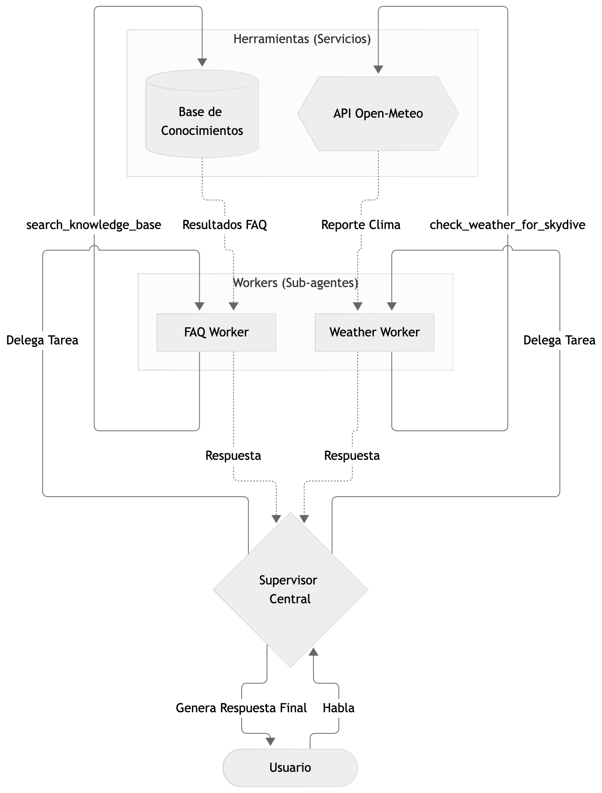
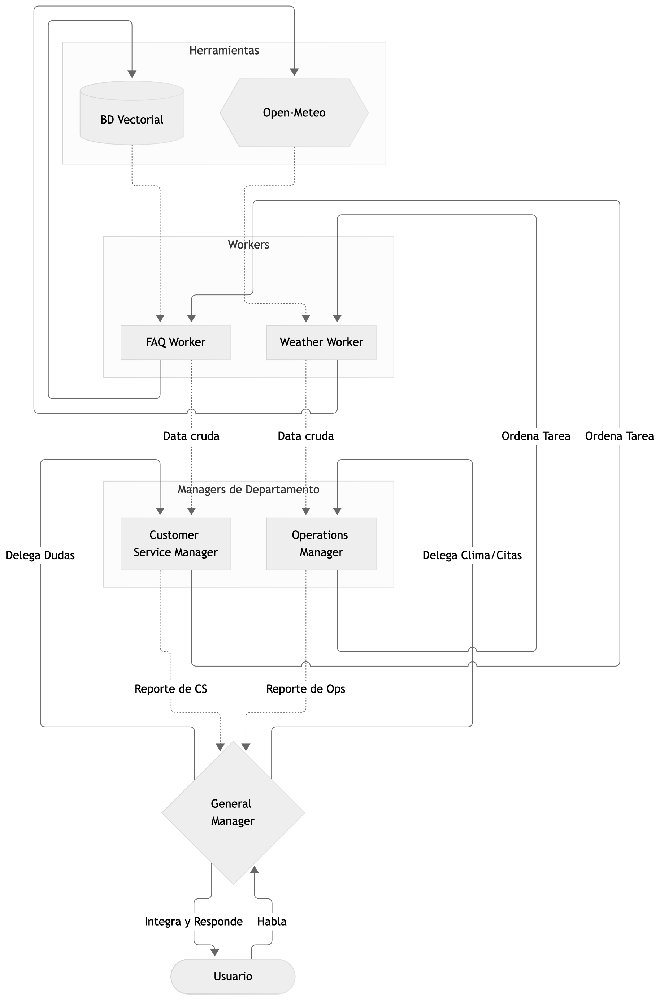
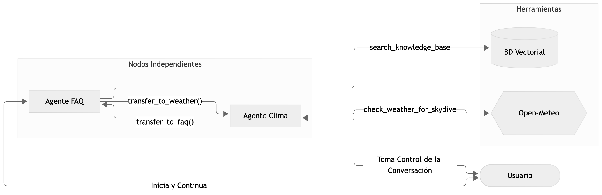

# Sistema Multi-Agente (MAS) para Parachute S.A.
### Arquitecturas Centralizada, Jerárquica y Descentralizada (Handoffs)

**Autor:** Hugo Méndez Lee - 241265  
**Curso:** AI Engineering Creativity
**Hoja de Trabajo 5 (HDT5):** Orquestación  

**Enlace al video de demostración:** https://youtu.be/x_yFsdggtT4 

---

## 📖 Descripción del Proyecto

Este proyecto implementa y compara tres patrones arquitectónicos fundamentales de **Sistemas Multi-Agente (MAS - Multi-Agent Systems)** para la empresa **Parachute S.A.**, orientados a la atención al cliente, resolución de dudas operativas y evaluación de viabilidad meteorológica para saltos en paracaídas en Guatemala.

El sistema se compone de dos capacidades de negocio esenciales:
1. **Base de Conocimientos Vectorial (RAG con PostgreSQL y pgvector):** Consulta semántica sobre 120 preguntas frecuentes oficiales (`Corpus_FAQs_Parachute_SA_2026.txt`) con metadatos categorizados, utilizando embeddings locales densos de 384 dimensiones (`all-MiniLM-L6-v2`) e indexación HNSW con distancia coseno.
2. **Servicio Meteorológico en Tiempo Real (Open-Meteo API):** Evaluación de condiciones atmosféricas para la zona de salto (*dropzone*) ubicada en **Puerto San José, Escuintla** (Latitud: `14.013722`, Longitud: `-90.771611`). Evalúa de forma estricta las normas de seguridad aérea entre las 08:00 y las 17:00 horas:
   - **Viento:** Óptimo < 20 km/h; Marginal 20–28 km/h; No recomendado > 28 km/h.
   - **Ráfagas:** Límite seguro ≤ 35 km/h.
   - **Precipitación:** Prohibido en presencia de lluvia (> 0.0 mm).
   - **Nubosidad:** Óptimo < 30%; Marginal 30–75%; No apto > 75%.

### 🧩 Principio de Abstracción y Desacoplamiento (`services.py`)
Para cumplir con las mejores prácticas de ingeniería de software y la consigna de no alterar la lógica de integración entre arquitecturas, todas las llamadas a bajo nivel (conexión a PostgreSQL, cálculo de embeddings, consultas SQL vectoriales y peticiones HTTP a Open-Meteo) están encapsuladas en el módulo centralizado [`services.py`](file:///Users/hugoml/Documents/U/A3/S2/AIEngineering/IA_HDT5/services.py). 

Las tres arquitecturas multi-agente (`centralized.py`, `hierarchical.py` y `decentralized.py`) importan estas funciones como componentes de caja negra:
- `search_knowledge_base(query: str, limit: int = 3)`
- `check_weather_for_skydive(date_str: str)`

---

## 🏛️ Arquitecturas Multi-Agente Implementadas

A continuación se detallan las tres arquitecturas diseñadas, acompañadas de sus diagramas de flujo y explicación técnica:

### 1. Arquitectura Centralizada (Supervisor - Workers)

En esta arquitectura existe un **Supervisor Central** que gestiona la sesión interactiva con el usuario. El supervisor analiza la intención y utiliza herramientas de delegación (*Function Calling*) para transferir subtareas a **Workers (Sub-agentes LLM especializados)**:
- **FAQ Worker:** Sub-agente enfocado exclusivamente en consultar la base de datos de preguntas frecuentes y formular una respuesta informativa.
- **Weather Worker:** Sub-agente especializado en interpretar los reportes meteorológicos de la API de Open-Meteo y emitir una recomendación de salto.

El Supervisor recibe los resultados de los workers y sintetiza una respuesta unificada para el usuario final.

<p align="center">
  
</p>

- **Archivo fuente:** [`centralized.py`](file:///Users/hugoml/Documents/U/A3/S2/AIEngineering/IA_HDT5/centralized.py)

---

### 2. Arquitectura Jerárquica (General Manager -> Managers -> Workers)

Estructurada en **3 niveles organizacionales**, emulando una cadena de mando corporativa:
- **Nivel 1 - General Manager (Top Level):** Mantiene el diálogo con el cliente, clasifica la necesidad global y delega a los gerentes de departamento mediante Function Calling.
- **Nivel 2 - Managers de Departamento (Middle Management):**
  - *Customer Service Manager:* Recibe la directiva, coordina con su worker de FAQs, valida la información y genera un informe estructurado de servicio al cliente.
  - *Operations Manager:* Evalúa la logística y autorizaciones de vuelo, delega la lectura meteorológica a su worker de clima y genera un reporte operativo.
- **Nivel 3 - Workers (Nivel Operativo):** Ejecutan las herramientas de base en [`services.py`](file:///Users/hugoml/Documents/U/A3/S2/AIEngineering/IA_HDT5/services.py) y entregan los datos crudos a sus respectivos gerentes.

La información fluye de manera ascendente: el Worker reporta al Manager, el Manager procesa y consolida el reporte para el General Manager, y este último responde al usuario final.

<p align="center">
  
</p>

- **Archivo fuente:** [`hierarchical.py`](file:///Users/hugoml/Documents/U/A3/S2/AIEngineering/IA_HDT5/hierarchical.py)

---

### 3. Arquitectura Descentralizada (Red de Handoffs entre Pares)

En este modelo **no existe un orquestador central**. Los agentes son nodos autónomos e independientes que interactúan directamente con el usuario:
- El usuario inicia la interacción con un agente inicial (**Agente FAQ**).
- Cada agente cuenta con su propio *System Prompt* y un conjunto específico de herramientas de dominio.
- Cuando una solicitud cae fuera de la competencia del agente activo (por ejemplo, cuando el usuario solicita revisar el pronóstico del tiempo o reservar una fecha), el agente activo invoca una función de transferencia (*Handoff*): `transfer_to_weather` o `transfer_to_faq`.
- El control de la conversación se transfiere de inmediato al agente receptor, quien toma el canal de comunicación directo con el usuario sin intermediarios.

<p align="center">
  
</p>

- **Archivo fuente:** [`decentralized.py`](file:///Users/hugoml/Documents/U/A3/S2/AIEngineering/IA_HDT5/decentralized.py)

---

## 🚀 Tecnologías y Herramientas

* **Python 3:** Lenguaje principal de desarrollo y orquestación.
* **PostgreSQL + pgvector:** Motor relacional con almacenamiento vectorial, índices HNSW y operadores de similitud coseno (`<=>`).
* **Docker & Docker Compose:** Contenedorización de la base de datos PostgreSQL.
* **Sentence Transformers (`all-MiniLM-L6-v2`):** Generación de embeddings densos de 384 dimensiones de manera local.
* **Open-Meteo API:** API REST para pronósticos meteorológicos por coordenadas geográficas sin clave requerida.
* **OpenAI Python SDK:** Interfaz para llamadas a modelos de chat y ejecución de Function Calling (Tools).
* **NVIDIA NIM (Inference Microservices):** Plataforma proveedora del modelo `meta/llama-3.2-11b-vision-instruct`.

---

## 📂 Estructura del Proyecto

```text
IA_HDT5/
├── .env                              # Variables de entorno locales (API Key, DB, Modelo)
├── .example_env                      # Plantilla de variables de entorno de ejemplo
├── .gitignore                        # Reglas de exclusión de Git
├── docker-compose.yml                # Despliegue de PostgreSQL con pgvector
├── docker-compose.example.yml        # Plantilla de configuración de Docker Compose
├── Corpus_FAQs_Parachute_SA_2026.txt # Base de conocimiento oficial (120 FAQs con categorías)
├── load_faqs.py                      # Script de ingesta: parseo, embeddings y carga a PostgreSQL
├── services.py                       # Módulo común de servicios (DB Vectorial + Open-Meteo API)
├── centralized.py                    # Implementación de Arquitectura Centralizada (Supervisor-Workers)
├── hierarchical.py                   # Implementación de Arquitectura Jerárquica (3 Niveles)
├── decentralized.py                  # Implementación de Arquitectura Descentralizada (Handoffs)
├── requirements.txt                  # Dependencias y librerías de Python
├── docs/
│   ├── respuestas.pdf                # Respuestas a las preguntas de análisis arquitectónico
│   └── diagramas/                    # Diagramas renderizados en PNG
│       ├── centralizado.png          # Diagrama de arquitectura centralizada
│       ├── jerarquico.png            # Diagrama de arquitectura jerárquica
│       └── decentralizado.png        # Diagrama de arquitectura descentralizada (handoffs)
└── README.md                         # Documentación completa del proyecto
```

---

## ⚙️ Requisitos Previos

1. **Docker Desktop** (o Docker Engine + Compose) instalado y activo.
2. **Python 3.10+** (probado en Python 3.10, 3.11, 3.12 y 3.13).
3. **API Key de NVIDIA Build** ([build.nvidia.com](https://build.nvidia.com/)) con créditos disponibles para el modelo `meta/llama-3.2-11b-vision-instruct`.

---

## 💻 Instrucciones de Instalación y Ejecución

Sigue estos pasos en orden para inicializar la infraestructura, preparar la base de datos y ejecutar cualquiera de las arquitecturas:

### 1. Clonar el repositorio
```bash
git clone https://github.com/hmndzzl/IA_HDT5.git
cd IA_HDT5
```

### 2. Inicializar la infraestructura (Docker)
Levanta el contenedor de PostgreSQL con la extensión `pgvector`:
```bash
docker compose up -d
```

Verifica que el servicio esté saludable:
```bash
docker compose ps
```

### 3. Crear y activar el entorno virtual
```bash
python3 -m venv .venv

# En macOS / Linux:
source .venv/bin/activate

# En Windows:
.venv\Scripts\activate
```

### 4. Instalar dependencias
```bash
pip install -r requirements.txt
```

### 5. Configurar las variables de entorno
Copia la plantilla `.example_env` a `.env`:
```bash
cp .example_env .env
```

Edita `.env` con tu clave de API de NVIDIA y credenciales de PostgreSQL:
```env
NVIDIA_API_KEY="nvapi-..."
NVIDIA_MODEL="meta/llama-3.2-11b-vision-instruct"

# Parámetros de PostgreSQL
DB_HOST=localhost
DB_PORT=5432
DB_NAME=parachute_faqs
DB_USER=postgres
DB_PASSWORD=postgrespassword
```

### 6. Cargar la base de conocimientos (`load_faqs.py`)
Ejecuta el script de ingesta para crear la tabla `faqs`, habilitar `pgvector`, calcular los embeddings con `all-MiniLM-L6-v2` e insertar los 120 registros:
```bash
python load_faqs.py
```

Salida esperada:
```text
============================================================
  CARGADOR DE EMBEDDINGS - PARACHUTE S.A.
============================================================
Corpus parseado: 120 preguntas encontradas.
Conectando a PostgreSQL (localhost:5432/parachute_faqs)...
Base de datos configurada con extensión pgvector y tabla 'faqs'.
Cargando modelo de embeddings 'all-MiniLM-L6-v2'...
Generando embeddings para las FAQs...
Guardando registros y vectores en PostgreSQL...
Carga completada con éxito. Total de FAQs en la base de datos: 120
============================================================
```

---

### 7. Ejecución de las Arquitecturas Multi-Agente

Cada arquitectura cuenta con su propio ejecutable interactivo en terminal. Para finalizar cualquier sesión, escribe `Bye` o presiona `Ctrl + C`.

#### A. Ejecutar Arquitectura Centralizada
```bash
python centralized.py
```
*El Supervisor Central atenderá tus consultas y delegará en segundo plano al FAQ Worker o al Weather Worker según corresponda.*

#### B. Ejecutar Arquitectura Jerárquica
```bash
python hierarchical.py
```
*El General Manager recibirá tu solicitud y descenderá la directiva por la jerarquía (General Manager -> CS / Ops Manager -> FAQ / Weather Worker).*

#### C. Ejecutar Arquitectura Descentralizada (Handoffs)
```bash
python decentralized.py
```
*Iniciarás conversando con el Agente FAQ. Cuando solicites información meteorológica o fechas, el agente ejecutará un Handoff hacia el Agente Clima en tiempo real.*

---

## 🧪 Ejemplos de Pruebas y Casos de Demostración

Puedes interactuar con cualquiera de los agentes utilizando los siguientes casos de uso:

### 1. Consultas de Políticas y Preguntas Frecuentes (RAG)
- *"¿Cuál es el peso máximo permitido para saltar y qué pasa si peso más de 90 kg?"*
- *"Hice buceo ayer en la tarde, ¿puedo realizar el salto hoy?"*
- *"¿Qué vestimenta y calzado debo llevar el día del evento?"*
- *"¿A qué altura se realiza el salto tándem y cuánto tiempo dura la caída libre?"*

### 2. Consultas de Clima y Factibilidad de Salto
*(Nota: Especifica fechas dentro de los próximos 16 días a partir de hoy)*
- *"Quiero saber si el clima es adecuado para saltar el 17 de septiembre de 2026."*
- *"¿Cuáles son las condiciones meteorológicas para el 2026-09-20 en el aeródromo?"*
- *"¿Cómo están las ráfagas de viento y la lluvia para el fin de semana?"*

### 3. Consultas Mixtas / Transición de Dominio
- *"Hola, primero dime qué requisitos médicos necesito para saltar, y luego dime si el clima para el 2026-09-18 permitirá realizar la actividad."*
- *(En arquitectura descentralizada, observa cómo el Agente FAQ atiende la primera parte y luego ejecuta la transferencia al Agente Clima).*

### 4. Preguntas Fuera de Dominio (Comportamiento Anti-Alucinación)
- *"¿Quién ganó el torneo de tenis de Roland Garros?"*
- *"Dame una receta para cocinar pasta Alfredo."*
- *Resultado esperado:* El sistema indica con transparencia que no posee información sobre ese tema y redirige la conversación a los servicios de Parachute S.A.
